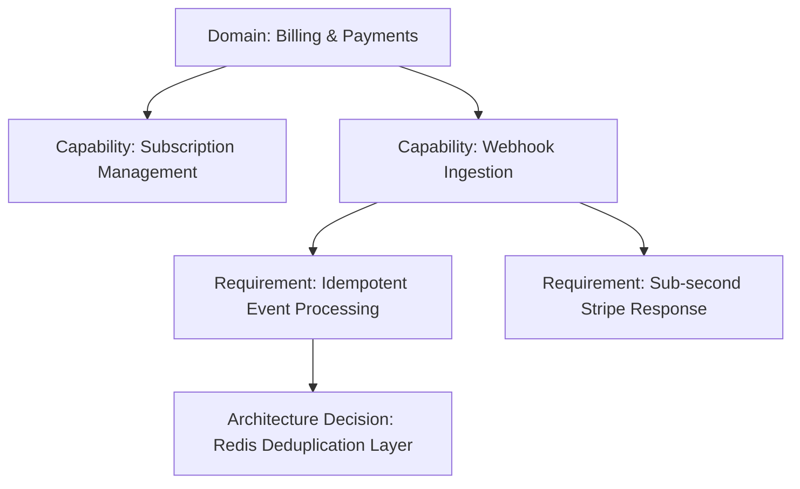

import { Callout } from 'fumadocs-ui/components/callout';
import { Mermaid } from '@/components/mdx/Mermaid';

# Domains, Capabilities & Requirements

To bridge the gap between high-level business vision and concrete technical components, Avylo breaks systems down using a three-tier hierarchy:

---

## 1. Domains
A **Domain** represents a cohesive functional territory of your product. Domains prevent architectural tangles by grouping related business logic into clear boundaries.

*Examples of Domains:*
- **Identity & Access Management (IAM)**
- **Billing & Subscriptions**
- **Content Ingestion & ETL**
- **Notification & Messaging**
- **Analytics & Reporting**

---

## 2. Capabilities
A **Capability** is a concrete, testable business function provided within a domain. Capabilities answer the question: *“What must the system be able to do?”*

*Examples of Capabilities:*
- *Process recurring subscription renewals.*
- *Accept and authenticate incoming webhooks from third parties.*
- *Generate asynchronous PDF invoices.*
- *Deliver multi-channel push notifications (SMS, Email, Push).*

---

## 3. Requirements
A **Requirement** defines the precise functional, non-functional, operational, or compliance criteria attached to a capability. Requirements answer: *“Under what constraints and performance criteria must this capability operate?”*

*Categories of Requirements:*
- **Performance**: P95 latency thresholds, queries per second (QPS), payload limits.
- **Reliability**: Availability SLAs, retry strategies, circuit breaking.
- **Security & Compliance**: Encryption at rest, field-level masking, audit logging.
- **Consistency**: ACID transactions, eventual consistency tolerance, distributed locking.

---

## The Traceability Advantage

Every single service, database, cache, and topic in your Canonical Architecture Model links directly back to one or more Requirements.

<Callout type="tip" title="No Orphaned Infrastructure">
When team members ask *“Why do we have a Redis cluster in front of our payment service?”*, Avylo shows the exact requirement: *Idempotent Webhook Ingestion with sub-millisecond deduplication checks*.
</Callout>
