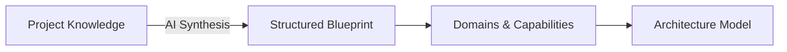

import { Callout } from 'fumadocs-ui/components/callout';
import { Mermaid } from '@/components/mdx/Mermaid';

# Project Knowledge & Blueprint

In traditional software development, architecture tools start by asking you to pick databases, cloud vendors, or serverless frameworks. This causes teams to design infrastructure disconnected from real business constraints.

Avylo takes the opposite approach: **business intent dictates technical architecture**.

---

## Project Knowledge

**Project Knowledge** is the primary source material that grounds your entire project. It is stored securely and versioned with your architecture.

### What to Include in Project Knowledge
- **Product Overview**: What the application does and the value proposition.
- **Target Users**: Who interacts with the system (e.g., end consumers, enterprise admins, internal operators).
- **Core User Journeys**: Step-by-step critical paths through the system.
- **Scale & Traffic Profiles**: Expected request volumes, concurrency peaks, and data retention requirements.
- **Regulatory & Security Requirements**: Compliance needs such as GDPR, HIPAA, or SOC 2.
- **Budget & Team Constraints**: Developer preferences, existing vendor commitments, or infrastructure budget limits.

---

## The Blueprint

The **Blueprint** is the AI-synthesized architectural thesis created from your Project Knowledge. It acts as an intermediary translation layer between non-technical business concepts and technical components.

### Blueprint Elements
1. **System Objective**: A concise summary of the primary architectural challenge (e.g., *“High-throughput event-driven ingestion pipeline with real-time analytics”*).
2. **Key Architectural Drivers**: The non-negotiable qualities of the system (e.g., *Sub-50ms latency*, *Multi-tenant data isolation*, *99.99% availability*).
3. **Core Business Boundaries**: The foundational domain breakdown used to isolate services.

<Callout type="info" title="Updating Your Blueprint">
Whenever your business goals shift or you add new product modules, updating your Project Knowledge prompts the AI Architect to re-evaluate the Blueprint and highlight any downstream architecture adjustments needed.
</Callout>
