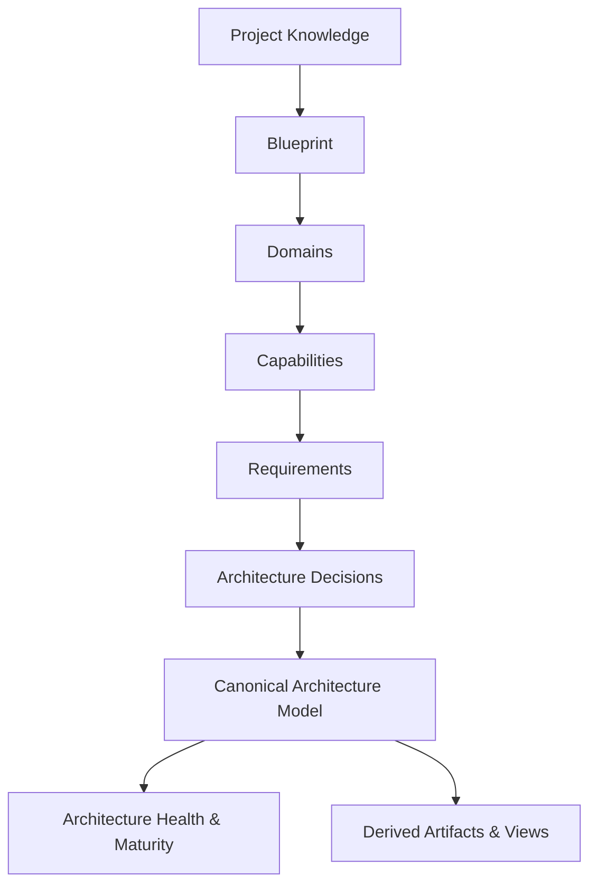

import { Callout } from 'fumadocs-ui/components/callout';
import { Cards, Card } from 'fumadocs-ui/components/card';
import { Mermaid } from '@/components/mdx/Mermaid';

# Core Concepts

Avylo uses a unified, consistent conceptual framework to model systems from initial idea to production-ready architecture. Understanding these concepts ensures you get the maximum value out of the platform.



---

## The Knowledge & Strategy Layer

### Project Knowledge
**Project Knowledge** is the private, revisioned source material provided by the creator. It contains raw product descriptions, user problem statements, pitch decks, target scale, compliance requirements, and business constraints.

### Blueprint
The **Blueprint** is the structured synthesis of your product intent derived from Project Knowledge. It defines the core product thesis, business boundaries, target personas, and primary operating constraints.

### Domain
A **Domain** represents a high-level functional or business boundary within your system (for example: *Identity & Access*, *Billing & Subscriptions*, *Data Ingestion*, *Real-Time Notifications*).

### Capability
A **Capability** is a discrete, buildable business function within a domain (for example: *OAuth2 Social Login*, *Idempotent Stripe Webhook Ingestion*, *Time-Series Metric Aggregation*). Capabilities make business intent concrete and verifiable.

### Requirement
A **Requirement** is an explicit technical, performance, compliance, or functional specification attached to a capability (for example: *Latency < 200ms at 95th percentile*, *SOC 2 audit logging requirement*, *Zero data loss queue persistence*).

---

## The Decision & Model Layer

### Architecture Decision
An **Architecture Decision** is an explicit, explainable choice regarding how a capability or requirement is satisfied technically. Every decision documents:
- **Context & Motivation**: Why this choice is being made now.
- **AI Recommendation**: The recommended pattern or technology.
- **Alternatives Considered**: Viable alternative architectures.
- **Trade-Off Analysis**: Pros and cons across latency, complexity, cost, and maintainability.
- **Confidence & Evidence**: Grounded justification linked to your project requirements.

### Canonical Architecture Model
The **Canonical Architecture Model** is the single editable source of truth for your software system. It defines all system components, data stores, message queues, external boundaries, and runtime connections.

<Callout type="warn" title="Authoritative Model vs. Derived Views">
Diagrams, exported specifications, and visual charts are **derived views**, not competing authorities. You modify the canonical architecture model; views update automatically.
</Callout>

### Architecture V1
**Architecture V1** is the first canonical architecture baseline generated when **Bootstrap Discovery** finishes. It represents a coherent, complete initial system ready for deep exploration and iteration.

---

## The Intelligence & Uncertainty Layer

### AI Architect
The **AI Architect** is your continuous architectural reasoning partner. It analyzes requirements, models technical dependencies, detects gaps, recommends optimizations, and formulates proposals. The AI Architect operates under creator authority and never silently applies destructive changes.

### Assumption
An **Assumption** is an AI-inferred value or default configuration that the creator has not yet explicitly confirmed (for example: *Assuming single-region AWS deployment based on initial traffic projections*). Assumptions are reviewable with `Accept` or `Change`.

### Open Decision
An **Open Decision** represents an unresolved, high-impact architectural branch point where multiple viable alternatives exist and the decision meaningfully changes downstream architecture (for example: *Event-Driven Kafka Architecture vs. Serverless Postgres CDC*).

<Callout type="info" title="Assumption vs. Open Decision">
- **Assumption**: Low-friction default inferred by AI. Acceptable to keep as-is.
- **Open Decision**: Material fork requiring explicit creator evaluation and trade-off comparison.
</Callout>

---

## Governance, Health & Lifecycle

### Architecture Health
**Architecture Health** provides an evidence-based assessment of your project across key dimensions:
- *Business Understanding*
- *Architecture Coverage*
- *Decision Confidence*
- *Missing Requirements*
- *Drift & Technical Debt*

Health is calculated from actual grounded evidence, not a synthetic or decorative vanity score.

### Architecture Maturity
**Architecture Maturity** represents the highest evidenced stage of your project lifecycle:
```text
Idea → Business Defined → Capabilities Complete → Architecture Stable → Deployment Ready
```
Maturity is objective and can regress if foundational business evidence becomes stale.

### Activity Timeline
The **Activity Timeline** is the chronological, human-readable record of architecture evolution, decision changes, and knowledge updates. It replaces ephemeral chat transcripts with a structured audit log.

### Change Set
A **Change Set** is an atomic, previewable proposal of architectural modifications. Creators inspect the full blast radius before applying a Change Set to the canonical model.

### Snapshot
An immutable, point-in-time record of the Canonical Architecture Model that can be used for milestone audits, comparisons, or rollbacks.

### Derived Artifact
Any export, diagram view, infrastructure specification, or summary document derived deterministically from the canonical model.

---

## Authority & Roles

### Creator
The project owner and primary author who retains full authority over the canonical model, approves proposals, and resolves open decisions.

### Reviewer
A scoped collaborator (such as an external technical advisor, investor, or staff engineer) who can inspect the architecture, review decisions, and submit structured feedback without direct edit permissions.
